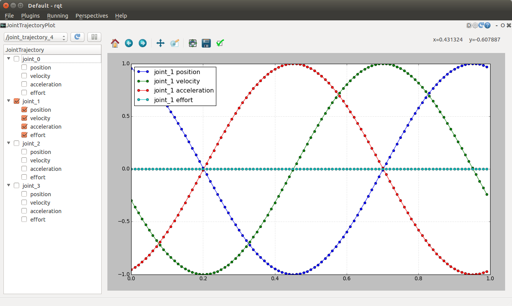
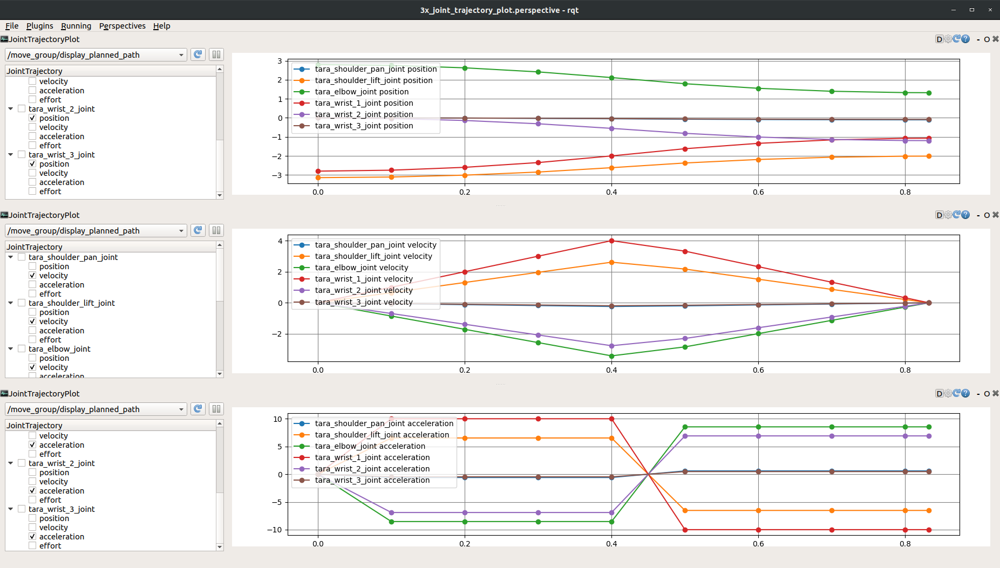

## rqt_joint_trajectory_plot



### To start up

Run rqt as:
```
 $ rqt
```
Choose the 'Plugins'->'Visualization'->'JointTrajectoryPlot'

If you don't have any node to publish JointTrajectory, start dummy
publisher as:

```
 $ roslaunch rqt_joint_trajectory_plot generator.launch
```   

To launch a pre-configured version of RQT with 3 plot tools to show Position, Velocity and Acceleration run as (the user is currently required to manually select pos, vel or accl for each plot):
```
 $ roslaunch rqt_joint_trajectory_plot rqt_plot_trajectory_pva.launch
```

### To select topic

Chooese the topic name from the pulldown menu. The menu has the topic
of trajectory_msgs/JointTrajectory type. If you don't see target
topic, push the reload button to refresh the topic list.

When you choose the topic, the plugin subscribe the target topic and ready to draw the curve in the plot area.

### To select curve to plot

Click the checkbox of the target joint name. You can choose the curve
of poistion, velocity, acceleration, and effort.

Beware the plugin redraws the graph each time when the new message arrived. If you want to stop the data update, push pause button. 
